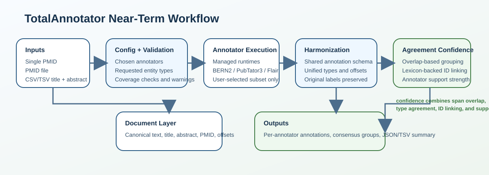

# TotalAnnotator Workflow Specification



## Purpose

The goal is to give users a reliable way to build biomedical corpora, run one
or more annotators in managed local environments, and prepare comparable outputs
for downstream evaluation.

## Near-Term Goal

Given a PubMed query, one PMID, a file containing PMIDs, a local corpus, or a
benchmark dataset, TotalAnnotator should:

1. resolve or load the documents into one internal document format
2. run only the annotators chosen by the user
3. harmonize each annotator result into a shared per-annotation schema
4. preserve each annotator's original labels, offsets, and normalization IDs
5. compute overlap-based agreement summaries across annotators
6. export both per-annotator results and unified project outputs
7. support benchmark-oriented evaluation on the same core document and annotation contracts

In short:

`query or corpus -> selected annotators -> harmonized annotations -> agreement summaries`

## Supported Inputs

The workflow should support these user-facing input modes.

### 1. Single PMID

Example:

```toml
[input]
pmids = ["31452104"]
```

### 2. PMID file

This should be the standard batch mode for PMID-based runs.

Example:

```toml
[input]
pmid_file = "data/inputs/pmids.txt"
```

Expected file shape:

```text
31452104
28777909
24107222
```

### 3. Text table

For user-supplied titles and abstracts, the workflow should accept a CSV or TSV
table instead of requiring inline text inside the config.

Example:

```toml
[input]
text_file = "data/inputs/documents.csv"
format = "csv"
document_id_column = "document_id"
title_column = "title"
abstract_column = "abstract"
```

Expected table shape:

```text
document_id,title,abstract
doc1,Autophagy maintains tumour growth...,We evaluated glioblastoma cell growth...
doc2,EGFR signaling in glioma...,Targeted inhibition altered downstream transcription...
```

### 4. Query to PMID file

For PubMed-based discovery, users should be able to search PubMed first and
save a PMID file for later reproducible ingestion.

Example:

```bash
uv run totalannotator search-pmids --query 'glioblastoma AND microRNA' --output data/inputs/query_pmids.txt
```

### 5. Benchmark dataset

Benchmark datasets should become a first-class input path so annotators can be
evaluated with the same pipeline abstractions used for PMIDs and local corpora.

## User Experience

The primary interface should be config-first.

Users should normally run:

```bash
uv run totalannotator run-config --config configs/pipeline.toml
```

The current repo interface is config-driven. CLI override flags for specific
pipeline fields are a possible future extension, but the main workflow should
stay centered on explicit config files.

## Config Design

The pipeline config should define at least these areas:

- `input`
- `enrichment`
- `annotators`
- `filters`
- `output`

Illustrative shape:

```toml
[input]
pmid_file = "data/inputs/pmids.txt"

[enrichment]
sources = []

[annotators]
enabled = ["bern2", "pubtator", "flair"]

[filters]
entity_types = ["gene", "drug", "variant"]

[output]
path = "outputs/current_run.json"
```

The config should stay readable for collaborators who are not focused on code.

## Managed Annotator Environments

TotalAnnotator is responsible for preparing and running the selected annotators.

The user should not need to manually understand each annotator's installation
details after repository setup.

That means the workflow should support:

- local environment preparation for supported annotators
- health checks before execution
- clear messages when a selected annotator is unavailable
- a shared configuration layer for enabled annotators

From the user's perspective, the question should be:

`Which annotators do I want to compare on these documents or benchmarks?`

## Entity-Type Harmonization

Each annotator may use different labels for related concepts.

Examples:

- `gene` vs `GENE`
- `drug` vs `chemical`
- `mutation` vs `variant`

TotalAnnotator therefore needs a project-level controlled vocabulary for entity
types. Annotator-specific labels should be mapped into that vocabulary.

Example project vocabulary:

- `gene`
- `protein`
- `drug`
- `disease`
- `variant`
- `species`
- `cell_line`
- `cell_type`
- `dna`
- `rna`

Important: this mapping should be internal adapter logic, not user-facing
configuration. A user should not need to write mapping tables to run a new
analysis. Instead:

- each annotator adapter knows how to interpret that annotator's labels
- the adapter converts them into TotalAnnotator entity types
- the original annotator label is still preserved in the output

This keeps normal use simple while still allowing new annotators to be added by
implementing one adapter well.

## Requested Entity Types

Users should be able to request the entity types they care about in the config.

Example:

```toml
[filters]
entity_types = ["gene", "drug", "variant"]
```

Before running the workflow, TotalAnnotator should validate whether the selected
annotators can satisfy those requests.

The system should report compatibility in three levels:

- `Info`
  Example: `pubtator label "Chemical" will be reported as project type "drug"`
- `Warning`
  Example: `flair does not provide "variant"; this type will only be collected from bern2 and pubtator`
- `Error`
  Example: `selected annotators do not provide the requested entity type "cell_line"`

This validation should happen before expensive runtime execution.

## Shared Per-Annotation Schema

The core project unit should remain:

`one annotation mention from one annotator`

This keeps provenance clean and makes debugging much easier.

Each harmonized annotation record should preserve both unified fields and
annotator-specific source data.

Suggested minimum structure:

```json
{
  "document_id": "PMID:31452104",
  "annotation_id": "bern2:PMID:31452104:1",
  "annotator": "bern2",
  "mention_text": "TP53",
  "start": 120,
  "end": 124,
  "entity_type": "gene",
  "entity_type_original": "GENE",
  "annotator_confidence": null,
  "normalizations": [
    {
      "namespace": "ncbi_gene",
      "identifier": "7157",
      "label": "TP53",
      "source": "annotator",
      "is_primary": true
    }
  ],
  "metadata": {}
}
```

The meaning should be simple:

- `mention_text` is the mention text stored for that annotation
- `start` and `end` are the harmonized offsets in the canonical document text
- `entity_type` is the TotalAnnotator type
- `entity_type_original` is the original annotator label

## Offset Harmonization

Annotators may report spans differently. Some may return:

- `start` and `end`
- `offset` and `length`
- mention text with incomplete span information

TotalAnnotator should convert all spans into one rule:

- `start` is inclusive
- `end` is exclusive
- offsets refer to the canonical stored document text

Validation should check:

- `0 <= start < end <= len(document_text)`
- `document_text[start:end]` matches the stored mention text when possible

This is important because downstream comparison depends on consistent offsets.

## Normalization and Lexicon Harmonization

Different annotators may normalize the same concept to different databases.

Examples:

- genes to NCBI Gene
- genes to Ensembl
- diseases to MeSH
- chemicals to ChEBI or MeSH

For this project, normalization should not stop at preserving raw IDs. The
workflow should also use project lexicons or cross-reference tables to connect
equivalent identifiers across databases.

Example:

- one annotator returns `NCBI Gene:7157`
- another returns `Ensembl:ENSG00000141510`
- a project lexicon links both identifiers to the same gene concept

This means TotalAnnotator should do two things:

1. preserve the original annotator-provided identifiers and namespaces
2. enrich them with lexicon-backed cross-database links when possible

That lexicon layer is important because it lets the project recognize when
annotators agree biologically even if they use different databases.

## Agreement and Confidence

The main shared schema should remain per-annotator, but TotalAnnotator should
also compute a derived agreement layer.

This agreement layer should behave like a confidence summary for the user.

### Important distinction

These are different concepts:

- `annotator_confidence`
  A score returned by the annotator itself, if available.
- `consensus_confidence`
  A TotalAnnotator-derived score based on cross-annotator evidence.

They should remain separate.

### Overlap-based matching

Agreement grouping should be overlap-based from the beginning.

Two annotations can be considered part of the same agreement group when they
share:

- the same document
- the same unified entity type
- overlapping spans

### Lexicon-backed identifier agreement

Overlap alone is not enough for the strongest confidence. Agreement should be
strengthened when:

- two annotators provide IDs in different databases
- TotalAnnotator lexicons show those IDs correspond to the same concept

For example, two overlapping gene mentions should receive stronger consensus if
their NCBI Gene and Ensembl IDs cross-resolve to the same gene.

### Consensus output

Agreement should be exported as a separate derived structure, not by replacing
the original annotations.

Suggested fields:

```json
{
  "group_id": "PMID:31452104:gene:3",
  "document_id": "PMID:31452104",
  "entity_type": "gene",
  "start": 120,
  "end": 124,
  "support_count": 2,
  "support_fraction": 0.67,
  "identifier_agreement": true,
  "supporting_annotators": ["bern2", "pubtator3"],
  "member_annotation_ids": [
    "bern2:PMID:31452104:1",
    "pubtator3:PMID:31452104:4"
  ]
}
```

In practice, user-facing confidence should reflect a combination of:

- overlap in mention spans
- agreement in entity type
- number of supporting annotators
- identifier agreement through lexicons or cross-reference tables

## End-to-End Workflow

The intended near-term execution flow is:

```text
Input config
  -> CLI overrides
  -> annotator and entity-type validation
  -> document loading from PMID(s) or text table
  -> selected annotator execution
  -> annotator-specific adapter normalization
  -> shared per-annotation schema validation
  -> overlap-based agreement grouping
  -> lexicon-backed ID reconciliation
  -> export raw and consensus outputs
```

## Outputs

Each run should produce both machine-readable outputs and a concise user-facing
summary.

At minimum, the machine-readable outputs should include:

- canonical input documents
- harmonized per-annotator annotation records
- derived agreement groups
- run metadata describing annotators, config, and timestamps

Possible export formats:

- JSON for full structured output
- TSV for easier inspection in spreadsheets or downstream scripts

The summary shown to the user should highlight:

- input document count
- annotators run successfully
- requested entity types
- unsupported or partially supported entity types
- total annotations per annotator
- agreement counts by entity type

## Design Boundaries for This Phase

This workflow is intentionally scoped to the current milestone.

The near-term implementation should do these things well:

- document ingestion
- annotator execution
- harmonized annotation output
- overlap-based consensus summaries
- lexicon-backed identifier reconciliation

The following belong to later phases and should stay outside the current repo
scope unless we explicitly revisit them:

- cross-annotator mention deduplication as the main source of truth
- heavier downstream harmonization and interpretation workflows
- broader research-stage automation described separately in `Workflow_longterm.md`

## Summary Statement

The near-term TotalAnnotator product is:

`a config-first annotation runner that accepts PMID or text-table input, executes selected annotators in managed environments, harmonizes their outputs into a shared schema, and reports overlap-based agreement summaries strengthened by lexicon-backed identifier matching`
